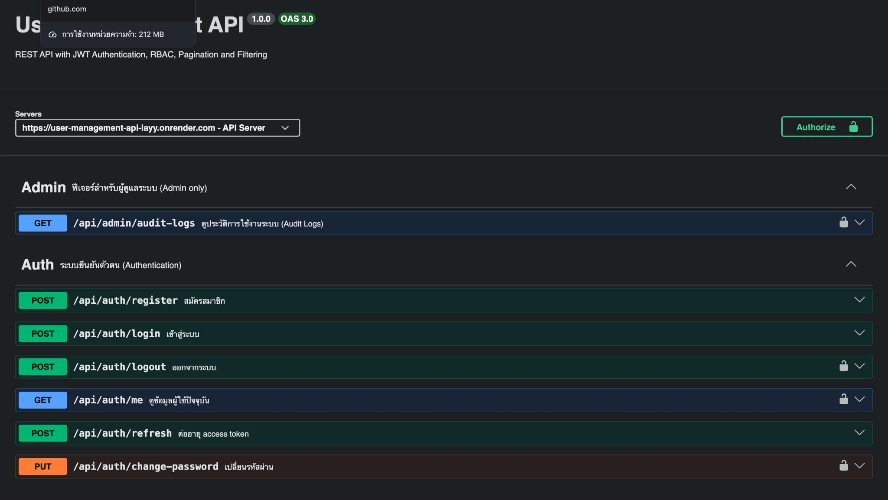

# User Management API

<p align="center">
  
</p>

RESTful API for user management built with **Node.js**, **Express.js**, and **PostgreSQL**.

## Highlights

- RESTful API Design
- JWT Authentication
- Role-Based Access Control (RBAC)
- Prisma ORM
- Docker Deployment
- Swagger API Documentation
- Unit & Integration Testing

## Features

- User Registration & Login
- JWT Authentication & Refresh Token
- Role-Based Access Control (Admin / User)
- User CRUD
- Audit Log
- Swagger API Documentation
- Unit & Integration Testing

## Tech Stack

- Node.js
- Express.js
- PostgreSQL
- Prisma ORM
- JWT
- Swagger
- Jest + Supertest
- Docker & Docker Compose

## Live Demo

- API: https://user-management-api-layy.onrender.com
- Swagger: https://user-management-api-layy.onrender.com/api-docs

## Getting Started

```bash
git clone https://github.com/Patcharadnaimingchua/user-management-api.git
cd user-management-api
docker compose up --build
```

## Demo Accounts

### Admin

```
Email: admin@example.com
Password: 12345678
```

### User

```
Email: user@example.com
Password: 12345678
```

## Developer

**Patcharadnai Mingchua**